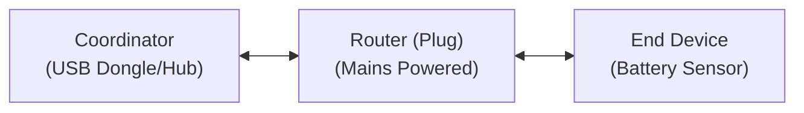
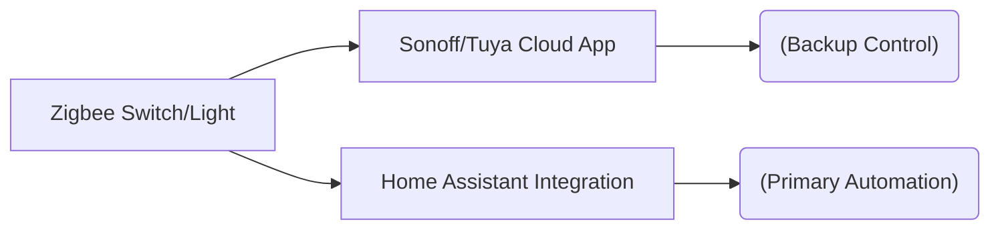

Assalamualaikum. 

If you look at how most people start their smart home journey here in Malaysia, the gateway drug is almost always the same: cheap, standalone Wi-Fi smart plugs, Tuya light switches, or generic door sensors bought on Shopee or Lazada. They plug right into your existing home router, need no extra hardware, and work out of the box.

But as your setup grows, you inevitably run into a wall. 

Once you hit 20, 30, or 40 Wi-Fi devices, your standard UniFi or Maxis router starts buckling under the pressure. Connections drop randomly, responses lag, and devices suddenly show up as "offline." 

When building a resilient smart home infrastructure, you have to move away from cluttering your Wi-Fi network and embrace a dedicated protocol. That is where **Zigbee** comes in. But over my years of tweaking my home lab, I’ve realized that choosing hardware isn't just about a technical spec sheet—it is about a **system architecture philosophy based on failure tolerance.**

---

## The Core Advantage: Why Zigbee?

Unlike Wi-Fi devices that scramble to talk directly to one central, power-hungry router, Zigbee devices form a cooperative **Mesh Network**. 

Mains-powered Zigbee hardware (like smart plugs with power monitoring) act as signal repeaters, bouncing data across the dense brick-and-mortar concrete walls typical of Malaysian houses. Meanwhile, battery-powered endpoints (like door and motion sensors) consume virtually zero standby power, allowing tiny button batteries to easily last for a year or more.

But how do you decide between running devices fully locally via an open platform like **Zigbee2MQTT (Z2M)** versus using a vendor cloud ecosystem like a **Sonoff** or **Tuya** hub? 

My decision matrix comes down to a strict rule based on the device's functional role.

---

## Rule 1: For Security, Local is Non-Negotiable (The Z2M Approach)

If a sensor is responsible for monitoring the security or state of my home—such as contact sensors on the main doors, motion sensors in the rooms, or water leak detectors—I prefer keeping them entirely local using **Zigbee2MQTT**.

### Why this matters:
* **Zero Internet Dependency:** If my fiber broadband drops or an external cloud server goes down in the middle of the night, my door triggers and security logic still execute locally with sub-100ms response times.
* **Privacy at the Edge:** Security sensors track when you enter rooms, open doors, and leave the house. Passing that data through third-party proprietary clouds means giving outside servers a precise log of your family's daily movements. 
* **True Vendor Independence:** Z2M acts as a universal translator over open MQTT. I can mix a Sonoff door sensor with an Aqara button or a Tuya radar module without needing five different proprietary hubs plugged into my switch.

---

## Rule 2: For Lights and Fans, Embrace Cloud Redundancy

When it comes to daily utility controls like overhead lighting, living room fans, or ambient switches, I deliberately choose a cloud-supported or dual-mode Zigbee ecosystem (like Sonoff or Tuya hubs). 

This comes down to a very pragmatic reason: **High Availability and the Backup Option.**

### The Scenario We Fear:
Let’s be honest: home lab servers undergo maintenance. You might be recalibrating a backup battery array, migrating Docker containers, or dealing with an unexpected Proxmox crash. 

If Home Assistant goes completely dark while you are working on the backend, **your family still needs to turn on the bathroom lights and fans.** By allowing environmental controls to retain a secondary cloud path or an independent ecosystem bridge, you build an ironclad fallback layer. If my primary local automation engine goes down, my family can still pull out a phone, fire up the native manufacturer app, and override the lights without needing a system administrator to fix a broken line of YAML first. It is the ultimate insurance policy for keeping peace in the household.

---

## Summary: Designing for Reality

A great smart home doesn't just prioritize absolute data ownership; it prioritizes operational resilience. Treat your security assets like a secure local fortress, but build your environmental utilities with practical redundancies so your house remains liveable no matter what happens to your server stack.

---

### Ready to set it up?

If you are ready to make the jump to fully local control and want to see how to wire the underlying architecture together inside your home server, check out my complete, in-depth video guide below. 

I walk through the entire setup process from scratch: installing a local Mosquitto MQTT broker, mapping your physical USB coordinator, configuring the Zigbee2MQTT environment, and pairing your first battery-powered sensors and smart plugs smoothly.



Drop a comment below on how you split your local vs. cloud logic, or share what smart home architecture problems you're tackling in your own setup!
