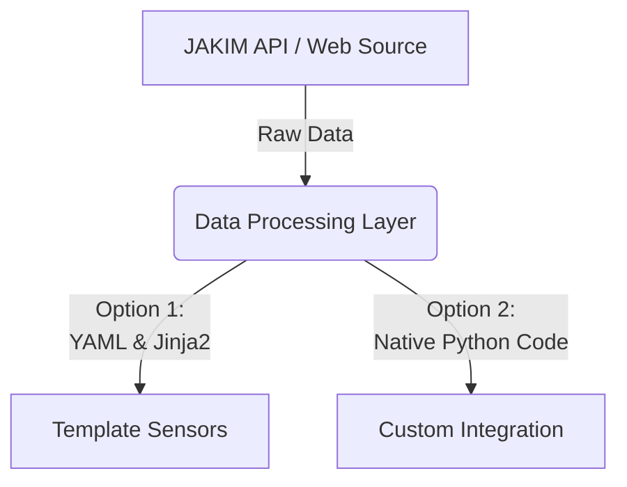

Assalamualaikum

Every Home Assistant user goes through a distinct evolution. You start by adding basic devices through the UI. Then, you want more control, so you dive into manual automations. Eventually, you realize you need custom data formats, leading you into the world of Jinja2 templating. Finally, as your smart home grows, you look for ways to scale your configurations without losing your sanity.

{: h="200" }

To explain the difference between **Templates vs. Integrations** and **Manual Automations vs. Blueprints**, I want to share a real-world case study from my own projects: the evolution of tracking and automating Islamic prayer times (eSolat) in Home Assistant.

We will look at how my legacy, template-driven approach (**HomeAssistantAdzan**) evolved into a streamlined, native custom component and blueprint ecosystem (**homeassistant-esolattakwim**).

## 🏗️ Part 1: Templates vs. Integrations (The Data Layer)

Before you can automate anything, Home Assistant needs data. How that data gets into your system makes all the difference.



### The Legacy Way: Template Entities (`HomeAssistantAdzan`)

Templates use the Jinja2 templating engine to manipulate, calculate, or reformat raw data already present in Home Assistant. 

In my original project, fetching prayer times from JAKIM relied heavily on the template approach. It worked, but it carried a heavy configuration burden:

- **The Setup:** Users had to deal with YAML packages, manual file placement inside `/config/HAMY`, and long chunks of complex Jinja2 code just to parse time strings.
- **The Entity Clutter:** The template approach forced the creation of 6 or 7 individual raw sensors (`sensor.solat_subuh`, `sensor.solat_maghrib`, etc.) cluttering the States developer tool.
- **Fragility:** If the underlying API structure changed, users had to dive into dense YAML file structures to update the parsing logic manually.

### The Modern Way: Native Integrations (`homeassistant-esolattakwim`)

Integrations are the foundational building blocks of Home Assistant. They are written in Python and connect directly to hardware, local hubs, or third-party cloud services.

When I rewrote the project into a proper custom integration installed via HACS, everything changed:

- **The Setup:** A clean user interface with a native options flow. Users just choose their state and zone code from a dropdown menu.
- **The Integration Elegance:** Instead of scattering multiple independent text entities requiring manual string extraction, the integration handles raw data normalization cleanly via Python, delivering robust native time sensors and calendar tracking directly.
- **The Maintenance:** The Python backend handles error catching, API retries, and data normalization entirely behind the scenes. 

> **The Verdict:** Use **Templates** for quick patches, math calculations between two existing sensors, or simple text formatting. Build or use an **Integration** when you need a robust, plug-and-play UI experience that handles API connections and state data cleanly.
{: .prompt-info }

## 📝 Part 2: Manual Automations vs. Blueprints (The Logic Layer) 

Once your data is clean, you have to do something with it. This is where we contrast bespoke control with scalable reusability.

### The Legacy Way: Manual Automations (YAML Packages)

Manual automations are built for a specific, tailored purpose in your home. You define the exact triggers, conditions, and actions either via the visual editor or raw YAML.

In the old template package, the automation logic was hardcoded alongside the sensors. If a user wanted to change their notification settings or target media players, they had to deal with expressions like this:


```yaml
trigger:
  - platform: template
    value_template: {{ state_attr('sensor.solat_maghrib', '24hours') == (now().strftime('%s') | int + 15*60) | timestamp_custom("%H:%M", false) }}
```

{: .nolineno }

- **The Problem:** If a user wanted to switch their announcement speaker from a Google Nest to an Amazon Echo, they had to modify the core automation code.
- **The Update Nightmare:** If I pushed a bug fix to the repository, updating meant the user risked overwriting their highly personalized media player or volume configurations.

### The Modern Way: Automation Blueprints

Blueprints separate the *logic* of an automation from the *specific devices* or entities being used. They act as a reusable blueprint mold.

With `homeassistant-esolattakwim`, the complex automation rules are entirely isolated into a separate, one-click importable Blueprint. 

Crucially, **using a blueprint doesn't mean you can't use individual sensor triggers.** Instead, it drastically simplifies them. Instead of processing complex string evaluation templates, the blueprint maps out direct time triggers and native offsets:

```yaml
triggers:
  - trigger: time
    alias: eSolat Time
    id: esolat_time
    at:
      - sensor.esolat_takwim_imsak
      - sensor.esolat_takwim_fajr
      - sensor.esolat_takwim_maghrib
  - trigger: time
    alias: eSolat Reminder
    id: esolat_reminder
    at:
      - entity_id: sensor.esolat_takwim_fajr
        offset: "-00:05:00"
      - entity_id: sensor.esolat_takwim_maghrib
        offset: "-00:15:00"
```
{: .nolineno }

- **The Benefit:** The user gets a beautiful UI form. They just select their target sensors, pick their smart speakers from a dropdown menu, toggle push notifications, or choose special audio files (like Eid Takbir).
- **The Logic Stays Untouched:** The under-the-hood parsing logic remains intact. If a bug is fixed in the blueprint, every automation created from it receives the fix automatically without wiping out the user's specific speaker selections.

> **The Verdict:** Use **Manual Automations** for highly unique, one-off logic that only applies to a single room or situation in your home. Use **Blueprints** when you want to share an automation framework with others, or when you need to replicate the exact same logic across multiple devices without duplicating code.
{: .prompt-tip }

## 🏁 Summary: Designing for the Future

Looking back at the transition between these two projects, the ideal architecture for any advanced Home Assistant project becomes clear:

| Feature | 🏛️ Legacy Setup (`HomeAssistantAdzan`) | ⚡ Modern Setup (`homeassistant-esolattakwim`) |
| :--- | :--- | :--- |
| **Data Engine** | Templates (Jinja2 & YAML) | Custom Integration (Python via HACS) |
| **User Setup** | 📝 Text-editor copy/paste | ⚙️ UI Integration Options Flow |
| **Automation** | Hardcoded Manual Automations | 🔄 Reusable Automation Blueprints |
| **Trigger Method** | 🛑 Heavy String-Matching Templates | ⏰ Clean Time Triggers & Native Offsets |

Templates and manual automations are incredible for prototyping. They allow you to test concepts quickly without writing a single line of Python. However, when you want to build an ecosystem that is stable, scalable, and easy for the community to adopt, migrating to a **Native Integration + Blueprint** model is the ultimate endgame.

*Have you migrated any of your complex YAML packages into integrations or blueprints yet? Let me know your thoughts or questions in the comments below!*
