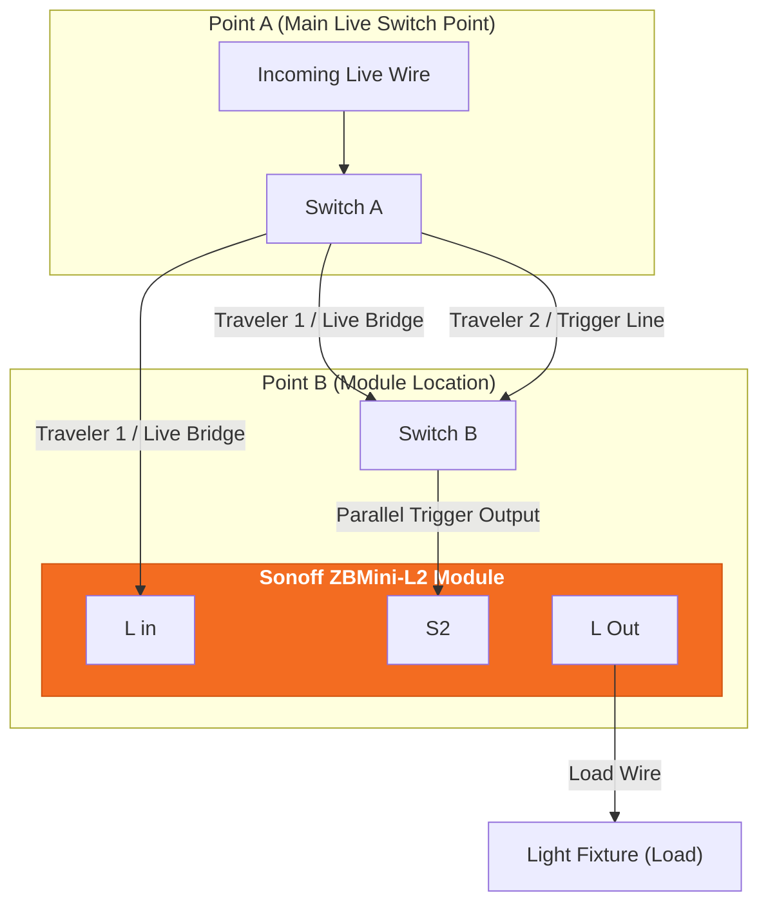

Assalamualaikum,

If you have tried automating traditional 2-way light switches; such as those controlling staircase or hallway lights from top and bottom. You know it can be tricky. Traditional non-neutral smart switch modules often rely on a bypass capacitor installed at the light fixture, which can eventually lead to annoying off-state light flickering (*ghosting*).

The **Sonoff Zigbee ZBMini-L2** solves this problem entirely. It requires **no neutral wire** and **no capacitor**, while being small enough to fit directly inside standard wall backboxes.

In this guide, we will break down the entire process of converting a traditional 2-way switch setup into a smart 2-way system using the ZBMini-L2.

---

## Key Benefits of the Sonoff ZBMini-L2

* `No Neutral Wire Required` Designed specifically for traditional single-live wiring setups.
* `Capacitor-Free` No need to install a bypass capacitor at the lamp fixture, eliminating light ghosting and flickering.
* `Ultra-Compact Form Factor` Easily fits inside most standard wall junction boxes behind your existing switch plate.
* `Preserves Physical Switch Control` Both physical switches remain fully operational while adding smart app and automation capabilities via a Zigbee hub.

---

## Understanding the Wiring: Old vs. New Setup

In a standard traditional 2-way setup, two traveler wires connect **Point A** (where the main Live feed arrives) and **Point B** (where the Line output leads to the lamp load).

When converting to the ZBMini-L2 setup:
1. **Live (`L In`)** is bridged across both switch locations.
2. **`S2` (Switch Trigger Terminal)** is connected in parallel to act as the toggle trigger for both physical switches.
3. **`L Out`** goes directly from the ZBMini-L2 module to the light fixture load.

### Circuit Overview

## Step-by-Step Installation Guide

> **Safety First**
> Always shut off the main circuit breaker controlling the light circuit before handling any electrical wiring. Use a voltage detector pen to double-check that no live current is present at both switch points.
> {: .prompt-warning }

### Step 1: Remove Old Capacitors (If Applicable)

If your previous smart switch setup relied on a capacitor, access your light fixture and remove the capacitor completely. The ZBMini-L2 operates cleanly without one.

### Step 2: Prepare Point A (Main Live Switch Point)

1. Identify the **Main Live Wire** coming from your mains supply.
2. Connect the Main Live wire to **Terminal L** of Switch A.
3. Connect **Traveler Wire 1** (Red) alongside the Main Live wire so it carries the Live feed straight through to Point B.
4. Connect **Traveler Wire 2** (Black) to the output terminal of Switch A.

### Step 3: Wire the ZBMini-L2 at Point B

1. Connect **Traveler Wire 1** (Live feed bridged from Point A) directly into the **`L IN`** terminal on the ZBMini-L2 module.
2. Bridge a short jumper wire from **`L IN`** on the ZBMini-L2 into the **`L`** terminal of Switch B.
3. Connect **Traveler Wire 2** (the trigger line from Switch A) into the terminal of Switch B.
4. Run a wire from that combined junction on Switch B straight into the **`S2`** terminal on the ZBMini-L2. *(Leave **`S1`** completely disconnected).*
5. Connect the **Load Wire** (leading to the light bulb) into the **`L OUT`** terminal on the ZBMini-L2.

---

## Physical Backbox Clearance & Fitting Tips

One common challenge during smart switch installations is backbox depth:

* **Checking Depth:** Place the ZBMini-L2 behind the switch mechanism inside the wall box. Ensure no wires are pinched or under excessive tension.
* **Using a Spacer (Optional):** If your wall box is shallow, you can install a 3D-printed or off-the-shelf switch spacer to extend the depth by a few millimeters.
* **Tidy Wire Bends:** Use solid-core or properly insulated flex wires bent neatly along the sides of the box to maximize internal space.

> **Pro Tip**
> Test fitting the module inside your backbox before tightening any screws permanently. If space is tight, tucking the module vertically to one side often gives the rocker switch mechanism the extra millimeter of clearance it needs.
> {: .prompt-tip }

---

## Pairing & Mode Switching

Once wiring is complete and power is restored at the breaker:

1. **Zigbee Pairing:** Press and hold the pairing button on the ZBMini-L2 until the LED indicator begins blinking. Add the device through your smart home app via your Zigbee bridge.
2. **Switch Type Selection:** The ZBMini-L2 supports both rocker (toggle) and momentary (push-button) switches. To change switch mode manually, quick-press the button on the ZBMini-L2 **three times consecutively**. The LED will flash to confirm the mode change.

---

## Full Video Walkthrough

For a complete visual demonstration—including live voltage testing, wire identification, and backbox fitting—check out the video guide below:



