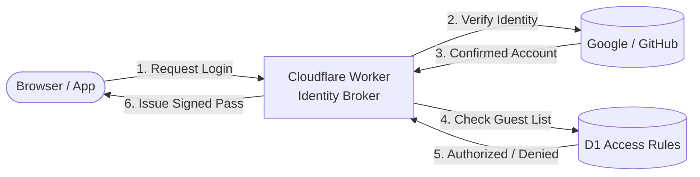
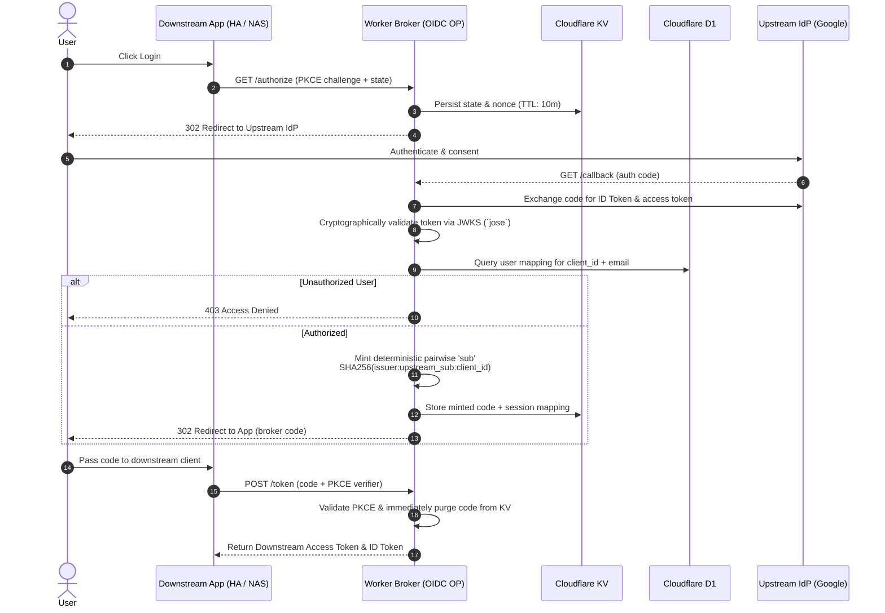

Managing passwords across a homelab gets exhausting. If you run Home Assistant, Proxmox, and a NAS, every service wants its own credential store. Traditional Single Sign-On (SSO) tools like Keycloak demand dedicated VMs and JVM tuning, while commercial proxies charge per-seat fees that make no sense for a family setup.

To solve this, I spent three weeks building `cloudflare-oidc-broker` a lightweight, serverless identity broker running on Cloudflare Workers that achieves 0 failures across the OpenID Foundation Basic OP Conformance Suite.

I have structured this post in two parts:

1. **The Layman View:** What it does, why it exists, and how it works without the jargon.
2. **The Deep Dive:** Architecture, flow diagrams, security hardening, and the real bugs caught while chasing spec compliance.

---

## Part 1: The Layman View

### What Is It?

Think of this broker as a digital receptionist sitting in front of my homelab services.

Instead of issuing separate accounts and passwords for every app, everyone logs in using an everyday Google or GitHub account. The broker checks a private guest list I control, decides which rooms (apps) that person is allowed to enter, and hands them a signed access pass.


### Why Not Off-the-Shelf Tools?

* **Enterprise SSO (Keycloak, Authentik):** Powerful, but heavy. I didn't want to run database containers and memory-heavy services 24/7 just to handle a few family logins.
* **Hosted Identity (Auth0, Okta):** Great APIs, but commercial pricing models quickly penalize you for adding users.
* **The Ideal Fix:** A tool that costs $0 to idle, runs globally at the edge, and requires zero server maintenance.

### The Basic Concept



In short: your apps trust your broker, the broker trusts Google, and you stay in control of who gets access to what.


---

## Part 2: The Technical Deep Dive

Building an OpenID Connect (OIDC) provider on paper is straightforward. Building one that satisfies strict protocol specs while tolerating quirky self-hosted clients is a humbling exercise.

The broker runs on **Cloudflare Workers** (TypeScript), using **Cloudflare D1** for the client registry and user mapping table, and **Cloudflare KV** for short-lived authorization codes, PKCE parameters, and session states.

### Core Architecture & Auth Flow

The broker never leaks upstream tokens downstream. Instead, it validates upstream credentials, checks authorization policies in D1, and mints an independent, RS256-signed `id_token` under its own issuer domain (`auth.yourdomain.com`).



---

### The Conformance Gauntlet: 5 Bugs Caught

To ensure the broker wasn't just working by coincidence, I ran it against the official **OpenID Foundation Conformance Suite** for the `Basic OP` profile.


The suite executes 35 automated modules testing spec compliance, error behavior, and protocol edge cases. Across the entire run, the broker completed with **0 failures** (18 passed, with warnings and reviews for optional spec behaviors intentionally left out of a minimal broker).

Reaching a clean test run without red failure blocks forced me to address several subtle vulnerabilities in my initial code:

#### 1. Lax PKCE Enforcement

* **The Flaw:** The initial implementation only verified PKCE if the client sent a `code_challenge`. If an unsophisticated or compromised client omitted it, the worker quietly fell back to an unverified exchange.
* **The Fix:** Aligned with OAuth 2.1 recommendations: `code_challenge_method=S256` is strictly required. Any authorization request without a SHA-256 challenge is rejected immediately.

#### 2. The `email_verified` Fallback Bug

* **The Flaw:** To prevent undefined errors, my code originally used:
`email_verified: userData.emailVerified ?? true`
If an upstream provider omitted the field, it defaulted to `true`—a massive security hazard that could let unverified accounts claim administrative rights.
* **The Fix:** Switched to strict boolean validation: `email_verified: userData.emailVerified === true`. If the claim is missing or false, authorization fails.

#### 3. The GitHub Unverified Email Trap

* **The Flaw:** GitHub's primary `/user` endpoint does not guarantee returning an email address, nor does it guarantee that an exposed email has been verified. Relying solely on that payload created account-takeover risks.
* **The Fix:** Added provider-specific logic querying `/user/emails`, filtering strictly for entries where `primary: true && verified: true`.

#### 4. The `prompt=none` Edge Case

* **The Flaw:** The OIDC specification allows clients to send `prompt=none` to check for an existing session without prompting the user. The initial broker code simply ignored this and redirected directly to Google.
* **The Fix:**
1. Detect `prompt=none`.
2. If no valid session cookie exists in KV, return `error=login_required` without redirecting.
3. If a session is valid, preserve the original `auth_time` claim rather than updating it to the current timestamp.

#### 5. Silent In-Flight Session Expiration

* **The Flaw:** Downstream clients sometimes pause during the OAuth dance, or take time completing redirects. Hardcoded KV entry lifecycles caused race conditions where state keys vanished mid-handshake.
* **The Fix:** Enforced strict, tiered TTLs: 10 minutes for ephemeral authorization codes and PKCE states, alongside a sliding 60-minute window for active user sessions.

---

### Real-World Homelab Quirks

Beyond strict protocol specs, standard self-hosted apps bring their own odd behaviors:

* **Incomplete Logout Handlers:** Apps like Home Assistant and Synology DSM often clear only their local browser session, completely skipping the spec's `end_session_endpoint`. The broker handles this passively by imposing a strict 1-hour expiration on session KV entries—abandoned sessions self-terminate automatically.
* **Cross-Site Cookie Blocking:** When iframes or cross-subdomain fetch calls trigger session checks, default `SameSite=Lax` cookies get blocked by modern browsers. The broker sets `SameSite=None; Secure; HttpOnly` on its session cookies to ensure clean cross-origin checks.
* **Dynamic Protocol Normalization:** If deployment configs pass an issuer URL with mixed protocols or trailing slashes, discovery validation breaks. The broker normalizes URLs dynamically on every request:

```typescript
export function getIssuer(request: Request, env: Env): string {
  let origin = env.ISSUER_URL ? env.ISSUER_URL.replace(/\/+$/, '') : new URL(request.url).origin;

  // Enforce HTTPS prefix to prevent upstream discovery mismatches
  if (origin.startsWith('http://')) {
    origin = 'https://' + origin.substring(7);
  } else if (!origin.startsWith('https://')) {
    origin = 'https://' + origin;
  }

  return origin;
}

```

---

## What It Powers Today

The broker is currently acting as the central identity gateway for my day-to-day self-hosted services:

* **Home Assistant**
* **Synology DSM**
* **Proxmox**
* **Wordpress**

Each service gets its own isolated `client_id`, with mapped identities (e.g., mapping `family_member@gmail.com` to a localized username with zero NAS access).

If you are looking to build or self-host your own edge-based identity layer without running full-blown directory containers, give it a spin. If you find the project helpful or interesting, dropping a ⭐ on the repository would mean a lot!

* **Source Code:** [github.com/zubir2k/cloudflare-oidc-broker](https://github.com/zubir2k/cloudflare-oidc-broker?utm_source=gemini)

---
